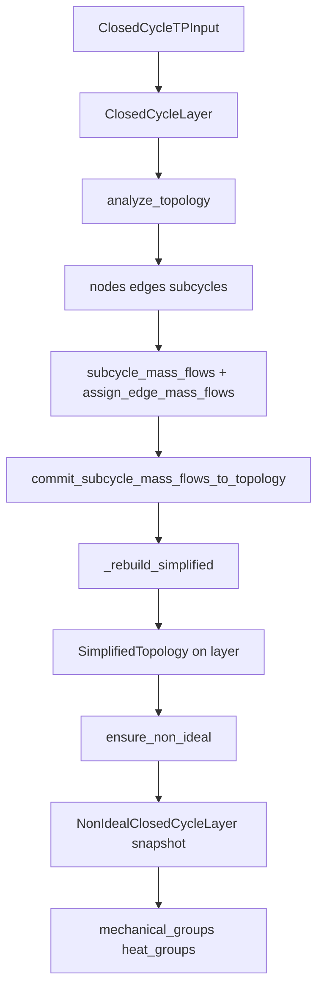

# CyGES — Agent 交接说明

本文档面向**接续开发的 Agent / 开发者**，描述当前仓库已实现内容、数据流、设计取舍与待办。用户向 README 见 [`README.md`](README.md)。

---

## 1. 项目目标（当前代码范围）

在**给定工质与温压包线**上，自动构建闭式循环的 **PS 平面离散拓扑**（节点、机械边 `M*`、换热边 `H*`、最小 4 节点子循环），支持**子循环质量流**写回边流量，并生成**活跃子图的精简拓扑**（链合并），为非理想修正（效率、节点状态偏移、约束）提供索引结构。

**边类型物理含义**（代码里 `kind` 即过程类型）：

| `kind` | 过程 | 非理想参数（`config`） | 说明 |
|--------|------|------------------------|------|
| `mechanical` / `SM*` | 叶轮机械工作（压缩/膨胀等） | `NON_IDEAL_MECHANICAL_EFFICIENCY_DEFAULT` → **等熵效率** `η_is` | `apply_mechanical_isentropic_offsets`：从基准沿无向支路 DFS 单向推进；每步 `H1 = PS(P_unknown, S_known)` → `η_is` 得 `H2` → `HP` 闭合（须先换热） |
| `heat` / `SH*` | 换热（加热/冷却等） | `NON_IDEAL_HEAT_EFFICIENCY_DEFAULT` → **总压恢复系数** `σ` | `apply_heat_pressure_offsets`：`P ← P_ideal × σ^layer`；末尾对**全部节点**用 `PS(P,S)` 重算 `T,H` |

**尚未实现**（勿在文档中写成已完成）：

- 非理想方程/约束装配、多目标优化器  
- 换热网络（HEN）与多热源/多冷源边界的耦合  

---

## 2. 运行方式

```bash
cd /path/to/CyGES
# 必须：项目根在 PYTHONPATH
$env:PYTHONPATH="."          # PowerShell
python -m pytest tests/ -q   # 当前 3 个绘图用例
```

依赖：Python 3.12+、CoolProp、pytest；matplotlib 仅绘图测试需要。

---

## 3. 架构与调用顺序



### 理想层 `ClosedCycleLayer`（[`core/closed_cycle_layer.py`](core/closed_cycle_layer.py)）

| 步骤 | 作用 |
|------|------|
| `build_node_edge_topology` | TP 网格 + 等熵二级点 + 机械/换热边；PS 单调定向 |
| `build_subcycles` | 枚举最小 4 环（顺时针模板） |
| `assign_edge_mass_flows_from_subcycles` | 子循环环量汇聚到 `Edge.mass_flow` |
| `_rebuild_simplified` | 过滤（子循环内、非零流量）+ 同类型链合并 → `layer.simplified` |

**失效语义**：`analyze_topology()` 与 `commit_subcycle_mass_flows_to_topology()` 会 `non_ideal = None`，并重建 `simplified`。非理想分析须在理想层稳定后 `ensure_non_ideal()`。

**空子循环**：`len(subcycles)==0` 时 `simplified` 为空骨架 + `RuntimeWarning`，不调用 `build_simplified_topology`。

### 非理想层 `NonIdealClosedCycleLayer`（[`core/non_ideal_closed_cycle_layer.py`](core/non_ideal_closed_cycle_layer.py)）

仅**快照**理想层 ensure 时刻的 `simplified`，并派生：

- `mechanical_groups` / `heat_groups`：`tuple[SimplifiedDirectedGroup, ...]`

**不修改**父层 `nodes` / `edges`。

`closed_cycle_layer` 对 `NonIdealClosedCycleLayer` 使用 `TYPE_CHECKING` + `ensure_non_ideal()` 内延迟 import，避免循环依赖。

---

## 4. 精简拓扑 `SimplifiedTopology`

- `kept_nodes`：保留的原始节点 index  
- `simplified_edges`：`SM*` / `SH*`，每条 `SimplifiedEdge` 含 `tail, head, constituent_edges, merged_nodes, mass_flow`（**无 `efficiency` 字段**）  
- `merged_into`：链上合并点 → 精简边键；四邻全空 → `MERGED_ISOLATED_NODE_EDGE_KEY`（`core.closed_cycle_layer`）

过滤规则见 `filter_topology_for_non_ideal`；合并规则见 `build_simplified_topology` 文档字符串。

---

## 5. 有向组与层号（重要）

### 5.1 定义

在每个 **`SimplifiedDirectedGroup`**（同一 `kind` 下、无向连通的一组精简边）内：

- 仅用该组边的 **`tail → head`** 建有向图  
- **层号**（`node_depth` 第二分量）= 组内**任一入度 0 源点**到该节点的**有向最长路径长度**（边数）；
  源点 layer=0；每条 `u → v` 满足 `layer[v] = max(layer[v], layer[u] + 1)`。`max_depth` 为组内最大层号  
- 实现：拓扑序 Kahn + DP，确保多源 DAG（多个独立源点、汇聚节点）下层号反映「上游经过的过程步数」  
- **`upstream_special_nodes`** = **`reach` 最大**的节点（`frozenset`，可并列；与 `layer==0` 源点集合一般不同，源点集合可能有多个，而 `upstream_special` 取下游延伸最长者）  
- 有向环 → `compute_group_downstream_reach` 抛 `ValueError`

示例（机械组）：`A→B→C`，`A→D`，`E→D` → 层号 A=0，B=1，C=2，D=1，E=0；special `{A}`。

换热非理想压力（已实现）：`P_non_ideal(v) = P_ideal(v) × σ ** layer(v)`，`σ` 为总压恢复系数（`config.NON_IDEAL_HEAT_EFFICIENCY_DEFAULT`）；`apply_heat_pressure_offsets()` 末尾再对**全部 `nodes`** 用 `PS(P_new, S)` 重算 `T,H`，使节点状态与新 `P` 自洽。不自动在 `ensure_non_ideal` 内调用。

机械非理想焓（已实现）：在每个 `SimplifiedDirectedGroup` 内从基准（一级节点或 `min(upstream_special_nodes)`）沿无向支路 DFS 单向推进，对每条精简机械边由已知端推未知端：
1. `H1 = state("PS", P_unknown, S_known)["H"]`（待求端压力下的等熵焓）；
2. 按边方向 `H2 = (H1 - H_known) / η_is + H_known`（压缩）或 `× η_is`（膨胀），等压时 `H2 = H_known`；
3. `state("HP", H2, P_unknown)` 写回完整 `T,P,H,S`。

锚点本身整点不动；调用前须先 `apply_heat_pressure_offsets()` 以让 `P,H` 反映换热后的状态。

### 5.2 机械 vs 换热：同一节点两套深度？

**会出现，且这是预期行为，不是 bug。**

同一 `Node.index` 可同时作为某条**机械精简边**与某条**换热精简边**的端点，因而会分别出现在：

- 某个 `mechanical_groups[i].node_depth` 里（机械深度）  
- 某个 `heat_groups[j].node_depth` 里（换热深度）  

两套深度在**不同有向子图**上计算，**数值可以不同**。偏移/约束应按 **kind + 组** 使用 `group.depth_dict()`，**不要**用全局 `node_index → 深度` 单表混用。

**当前存储方式（方案 A，已实现）**：

- 深度挂在 **`SimplifiedDirectedGroup.node_depth`**（已含 `kind`）  
- 查询：`group.depth_dict()[v]`、`group.max_depth`  

**若下游逻辑需要按节点汇总**，建议显式维护例如 `depth_mech` / `depth_heat` 两个字典，或保留组内查询。

### 5.3 绘图

[`tests/test_non_ideal_offsets_plot.py`](tests/test_non_ideal_offsets_plot.py) 在精简拓扑上对比理想 vs 应用 `σ`/`η_is` 偏移后的节点状态；数据层 `upstream_special_nodes` 仍为 **全部 reach 最大** 节点（`frozenset`）。

---

## 6. 主要类型与导出

`core/__init__.py` re-export 常用符号，包括：

`ClosedCycleLayer`, `SimplifiedTopology`, `SimplifiedDirectedGroup`, `NonIdealClosedCycleLayer`, `build_simplified_topology`, `build_directed_groups`, `compute_group_downstream_depth`, `partition_simplified_edges_by_kind`, `MERGED_ISOLATED_NODE_EDGE_KEY`, …

---

## 7. 测试

| 文件 | 内容 |
|------|------|
| [`tests/test_tp_topology.py`](tests/test_tp_topology.py) | 理想 He 循环 → `ts_topology_he.png` |
| [`tests/test_non_ideal_offsets_plot.py`](tests/test_non_ideal_offsets_plot.py) | 非理想偏移（σ、η_is）前后对比 → `non_ideal_offsets_he.png` 等 |

生成 PNG 未纳入 git（可本地 pytest 再生）。

---

## 8. 建议的下一步实现（优先级供参考）

1. **非理想偏移**：换热 `P` + 全表 `PS` 闭合、机械 `PS→η→HP` 已实现；方程装配与机械 `P` 等待做。  
2. **效率常量**：`σ` / `η_is` 均已从 config 读取；按边分别赋值仍待做。  
3. **API 收紧**：若确认每组只需一个特殊节点，将 `upstream_special_nodes: frozenset` 改为 `upstream_special_node: int` 并统一 tie-break。  
4. **机械/换热深度分离**：在偏移模块中按 kind 使用 `depth_dict()`（见 §5.2）。  
5. **熵单调性诊断**：当前算法不强约束沿机械边 `ΔS ≥ 0`，仅在大多数物理情况下成立；如需硬约束可加偏移后校验或换用 PS→HP 之外的闭合策略。

---

## 9. 仓库其它目录

- [`inputs/`](inputs/)、[`solvers/`](solvers/)、[`optimize/`](optimize/)、[`oldFile/`](oldFile/)：历史或占位，**非当前 API 依据**。改拓扑主干时以 `core/` + `tests/` 为准。

---

## 10. Git / 协作约定

- 用户未明确要求时**不要**自动 `git commit` / `push`。  
- 改代码保持与现有风格一致：dataclass、`frozen` 快照、中文 docstring、小步 diff。  
- 用户文档用 [`README.md`](README.md)；本文件仅 Agent 交接，有架构变更时请同步更新 §3–§5 与 README 中 `ensure_non_ideal` 段落。

---

*最后更新：反映「精简拓扑在理想层、`NonIdealClosedCycleLayer` + `SimplifiedDirectedGroup` + 组内深度」当前主干。*
