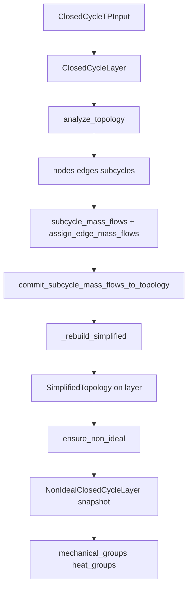

# CyGES — Agent 交接说明

本文档面向**接续开发的 Agent / 开发者**，描述当前仓库已实现内容、数据流、设计取舍与待办。用户向 README 见 [`README.md`](README.md)。

---

## 1. 项目目标（当前代码范围）

在**给定工质与温压包线**上，自动构建闭式循环的 **PS 平面离散拓扑**（节点、机械边 `M*`、换热边 `H*`、最小 4 节点子循环），支持**子循环质量流**写回边流量，并生成**活跃子图的精简拓扑**（链合并），为非理想修正（效率、节点状态偏移、约束）提供索引结构。

**尚未实现**（勿在文档中写成已完成）：

- 非理想条件下的节点偏移与方程/约束装配  
- 多目标优化器对接  
- 换热网络（HEN）与多热源/多冷源边界的耦合  
- `config.NON_IDEAL_*_EFFICIENCY_DEFAULT` 的读取（常量已保留，代码未用）

---

## 2. 运行方式

```bash
cd /path/to/CyGES
# 必须：项目根在 PYTHONPATH
$env:PYTHONPATH="."          # PowerShell
python -m pytest tests/ -q   # 当前约 12 个用例
```

依赖：Python 3.12+、CoolProp、pytest；matplotlib 仅绘图测试需要。

---

## 3. 架构与调用顺序



### 理想层 `ClosedCycleLayer`（[`core/closed_cycle_layer.py`](core/closed_cycle_layer.py)）

| 步骤 | 作用 |
|------|------|
| `build_node_edge_topology` | TP 网格 + 等熵二级点 + 机械/换热边；PS 单调定向 |
| `build_subcycles` | 枚举最小 4 环（顺时针模板） |
| `assign_edge_mass_flows_from_subcycles` | 子循环环量汇聚到 `Edge.mass_flow` |
| `_rebuild_simplified` | 过滤（子循环内、非零流量）+ 同类型链合并 → `layer.simplified` |

**失效语义**：`analyze_topology()` 与 `commit_subcycle_mass_flows_to_topology()` 会 `non_ideal = None`，并重建 `simplified`。非理想分析须在理想层稳定后 `ensure_non_ideal()`。

**空子循环**：`len(subcycles)==0` 时 `simplified` 为空骨架 + `RuntimeWarning`，不调用 `build_simplified_topology`。

### 非理想层 `NonIdealClosedCycleLayer`（[`core/non_ideal_closed_cycle_layer.py`](core/non_ideal_closed_cycle_layer.py)）

仅**快照**理想层 ensure 时刻的 `simplified`，并派生：

- `mechanical_groups` / `heat_groups`：`tuple[SimplifiedDirectedGroup, ...]`

**不修改**父层 `nodes` / `edges`。

`closed_cycle_layer` 对 `NonIdealClosedCycleLayer` 使用 `TYPE_CHECKING` + `ensure_non_ideal()` 内延迟 import，避免循环依赖。

---

## 4. 精简拓扑 `SimplifiedTopology`

- `kept_nodes`：保留的原始节点 index  
- `simplified_edges`：`SM*` / `SH*`，每条 `SimplifiedEdge` 含 `tail, head, constituent_edges, merged_nodes, mass_flow`（**无 `efficiency` 字段**）  
- `merged_into`：链上合并点 → 精简边键；四邻全空 → `MERGED_ISOLATED_NODE_EDGE_KEY`（`core.closed_cycle_layer`）

过滤规则见 `filter_topology_for_non_ideal`；合并规则见 `build_simplified_topology` 文档字符串。

---

## 5. 有向组与下游深度（重要）

### 5.1 定义

在每个 **`SimplifiedDirectedGroup`**（同一 `kind` 下、无向连通的一组精简边）内：

- 仅用该组边的 **`tail → head`** 建有向图  
- **深度** = 从节点 `v` 出发的最长有向路径**边数**（无出边为 0）；存于 `node_depth` 的第二个分量  
- **`max_depth`**：组内深度的最大值（`SimplifiedDirectedGroup` 属性）  
- **`upstream_special_nodes`** = 组内所有深度等于 `max_depth` 的节点（`frozenset`，**可并列**）  
- 有向环 → `compute_group_downstream_depth` 抛 `ValueError`

示例（机械组）：`A→B→C`，`A→D`，`E→D` → A 深度为 2，B/E 为 1，特殊节点仅 `{A}`。

### 5.2 机械 vs 换热：同一节点两套深度？

**会出现，且这是预期行为，不是 bug。**

同一 `Node.index` 可同时作为某条**机械精简边**与某条**换热精简边**的端点，因而会分别出现在：

- 某个 `mechanical_groups[i].node_depth` 里（机械深度）  
- 某个 `heat_groups[j].node_depth` 里（换热深度）  

两套深度在**不同有向子图**上计算，**数值可以不同**。偏移/约束应按 **kind + 组** 使用 `group.depth_dict()`，**不要**用全局 `node_index → 深度` 单表混用。

**当前存储方式（方案 A，已实现）**：

- 深度挂在 **`SimplifiedDirectedGroup.node_depth`**（已含 `kind`）  
- 查询：`group.depth_dict()[v]`、`group.max_depth`  

**若下游逻辑需要按节点汇总**，建议显式维护例如 `depth_mech` / `depth_heat` 两个字典，或保留组内查询。

### 5.3 绘图与数据模型的差异

[`tests/test_non_ideal_topology.py`](tests/test_non_ideal_topology.py) 中：

- **每个有向组**只高亮 **一个** 深度最大节点（并列时取 **index 最小**）  
- 数据层 `upstream_special_nodes` 仍为 **全部并列最大深度**  

若产品逻辑要求数据层也「每组仅一个特殊节点」，应改 `build_directed_groups`（例如 `upstream_special_node: int` + tie-break），并同步测试。

---

## 6. 主要类型与导出

`core/__init__.py` re-export 常用符号，包括：

`ClosedCycleLayer`, `SimplifiedTopology`, `SimplifiedDirectedGroup`, `NonIdealClosedCycleLayer`, `build_simplified_topology`, `build_directed_groups`, `compute_group_downstream_depth`, `partition_simplified_edges_by_kind`, `MERGED_ISOLATED_NODE_EDGE_KEY`, …

---

## 7. 测试

| 文件 | 内容 |
|------|------|
| [`tests/test_tp_topology.py`](tests/test_tp_topology.py) | 子循环流量、analyze/commit、非理想清空、`simplified` 重建、有向组划分、分叉图深度单测、He 全拓扑图 `ts_topology_he.png` |
| [`tests/test_non_ideal_topology.py`](tests/test_non_ideal_topology.py) | He 随机子循环流量 → commit → ensure_non_ideal → 精简图 `simplified_topology_he.png`（含 max-depth 高亮） |

生成 PNG 未纳入 git（可本地 pytest 再生）。

---

## 8. 建议的下一步实现（优先级供参考）

1. **非理想偏移**：按 `SimplifiedDirectedGroup` 以 `upstream_special_nodes`（或改为单点）为锚，沿 `tail→head` 传播；同深度层可共享偏移参数。  
2. **效率**：从 `config` 读 `NON_IDEAL_MECHANICAL_EFFICIENCY_DEFAULT` / `NON_IDEAL_HEAT_EFFICIENCY_DEFAULT`，挂到非理想层（不必塞回 `SimplifiedEdge`）。  
3. **API 收紧**：若确认每组只需一个特殊节点，将 `upstream_special_nodes: frozenset` 改为 `upstream_special_node: int` 并统一 tie-break。  
4. **机械/换热深度分离**：在偏移模块中按 kind 使用 `depth_dict()`（见 §5.2）。

---

## 9. 仓库其它目录

- [`inputs/`](inputs/)、[`solvers/`](solvers/)、[`optimize/`](optimize/)、[`oldFile/`](oldFile/)：历史或占位，**非当前 API 依据**。改拓扑主干时以 `core/` + `tests/` 为准。

---

## 10. Git / 协作约定

- 用户未明确要求时**不要**自动 `git commit` / `push`。  
- 改代码保持与现有风格一致：dataclass、`frozen` 快照、中文 docstring、小步 diff。  
- 用户文档用 [`README.md`](README.md)；本文件仅 Agent 交接，有架构变更时请同步更新 §3–§5 与 README 中 `ensure_non_ideal` 段落。

---

*最后更新：反映「精简拓扑在理想层、`NonIdealClosedCycleLayer` + `SimplifiedDirectedGroup` + 组内深度」当前主干。*
