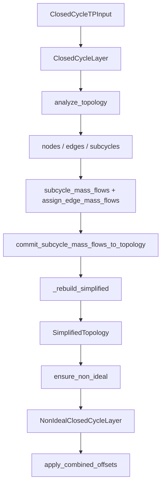

# CyGES 架构与算法细节

本文档是 CyGES 主干算法的**单一信息源**。[`README.md`](../README.md) 面向用户；[`AGENTS.md`](../AGENTS.md) 面向 Agent；代码 docstring 只写契约并引用本文件。

> 单位：`T[K]`、`P[kPa]`、`H[kJ/kg]`、`S[kJ/(kg·K)]`，字段名不缀单位。

---

## 1. 总体流程



**失效语义**：`analyze_topology()` 与 `commit_subcycle_mass_flows_to_topology()` 末尾重建 `simplified` 并置 `non_ideal = None`。须在理想层流量稳定后再 `ensure_non_ideal()`。

**代码分节**（与阅读顺序一致）：

| 模块 | 分节 |
|------|------|
| [`closed_cycle_layer.py`](../core/closed_cycle_layer.py) | §1 模型 → §2 小工具 → §3 拓扑构建 → §4 子循环 → §5 精简 → §6 入口类 |
| [`non_ideal_closed_cycle_layer.py`](../core/non_ideal_closed_cycle_layer.py) | §1 分组 → §2 数据类 → §3 深度 → §4 组构造 → §5 容器 → §6 偏置 |

---

## 2. PS 平面约定

| 量 | 方向 |
|----|------|
| `P` | 自下而上增大 |
| `S` | 自左而右增大 |

边 `tail → head` 在容差下满足 `P_tail ≤ P_head` 且 `S_tail ≤ S_head`。

- **机械边**（`mechanical`）：沿 P，`tail.edge_up` / `head.edge_down`。
- **换热边**（`heat`）：沿 S，`tail.edge_right` / `head.edge_left`。

[`build_node_edge_topology`](../core/closed_cycle_layer.py) 内嵌 `oriented_edge` 判定方向；无法判定则 `RuntimeError`。

---

## 3. 拓扑构建流水线

[`build_node_edge_topology`](../core/closed_cycle_layer.py)（理想层 §3）：

1. `build_axis` 生成温、压一维采样。
2. **一级 TP 网格**：`state("TP", T, P)` → `H, S`；CoolProp 异常记入 `skipped_points`。
3. **二级等熵延伸**：沿一级点 `S` 在 `p_axis` 上 `state("PS", P, S)`；超 `[t_min,t_max]` 或异常则丢弃。
4. **机械边 `M*`**：每个一级点及其二级子点按 `P` 升序相邻成链。
5. **换热边 `H*`**：等压桶内按 `S` 升序相邻成链。
6. `_attach_edges_to_nodes_ps` 回写四邻槽。

---

## 4. 子循环模板

[`build_subcycles`](../core/closed_cycle_layer.py)（理想层 §4）枚举最小 4 节点环：

```
左上 ─上(H)─ 右上
 │              │
 左(M)        右(M)
 │              │
左下 ─下(H)─ 右下
```

走法：左下 `n0` → `edge_up` → `edge_right` → `edge_down`（取 `tail`）→ `edge_left`（取 `tail`）回到 `n0`；四角互异；`frozenset` 去重。

- `SubCycle.nodes = (左下, 左上, 右上, 右下)` 顺时针。
- `SubCycle.edges = (左, 上, 右, 下)`；左/右机械，上/下换热。

---

## 5. 边流量汇聚

[`assign_edge_mass_flows_from_subcycles`](../core/closed_cycle_layer.py)：

- `SubCycle.mass_flow > 0`：顺时针 `(左下→左上→右上→右下→左下)`；`< 0` 逆时针；`None` 按 `0`。
- 边 `mass_flow` = 穿过该边的子循环代数和：段与 `tail→head` 同向 `+q`，反向 `-q`。
- 段与边端点不一致 → `ValueError`。

---

## 6. 精简拓扑

[`build_simplified_topology`](../core/closed_cycle_layer.py)（理想层 §5）：在活跃子图（属于某子循环且边流量非零）上合并同类型链。

### 6.1 过滤

[`filter_topology_for_non_ideal`](../core/closed_cycle_layer.py)：

- 保留：出现在某 `SubCycle.edges` 且 `mass_flow` 非 `None`、容差非零。
- 剔除边的邻接槽置 `None`。

### 6.2 链合并

- 仅挂换热邻边 → 可并入换热链；仅挂机械邻边 → 可并入机械链；否则为切分点/端点。
- `_find_typed_chains`：按 `kind` DFS 简单链；`_simplify_chain`：切分点间合并为 `SimplifiedEdge`。

### 6.3 方向规范化

| 聚合 `mass_flow` | `tail→head` | 输出 `mass_flow` |
|------------------|-------------|------------------|
| `None` / `0` / `> 0` | PS 正向 | 原值或 `None` |
| `< 0` | **反向** | `abs(原值)` |

段内原始边流量不一致 → `ValueError`。

### 6.4 占位

四邻全空且未上链的节点 → `merged_into` 记 `MERGED_ISOLATED_NODE_EDGE_KEY`；不在 `kept_nodes`。

---

## 7. 有向组与深度

[`SimplifiedDirectedGroup`](../core/non_ideal_closed_cycle_layer.py)（非理想层 §2）：同 `kind`、无向连通的一组精简边。深度只在组内有意义。

### 7.1 分组与邻接

- [`partition_simplified_edges_by_kind`](../core/non_ideal_closed_cycle_layer.py)（§1）：并查集按无向连通分量分组。
- [`_group_adjacency`](../core/non_ideal_closed_cycle_layer.py)（§3）：组内 `tail→head` 有向邻接。

### 7.2 `reach`

[`compute_group_downstream_reach`](../core/non_ideal_closed_cycle_layer.py)：`reach(v)` = 沿 `tail→head` 最长下游路径边数；无出边为 `0`；有向环 → `ValueError`。`upstream_special_nodes = argmax(reach)`（`frozenset`，可并列）。

### 7.3 `layer`：主脊分层

[`_compute_layer_by_spine`](../core/non_ideal_closed_cycle_layer.py)（§3）：

1. Kahn + DP 得 `dist(v)` = 从任一源点到 `v` 的最长有向路径边数。
2. 在 `dist(end)=max(dist)` 的终点上回溯最长路径起点；**并列取 index 最小**。
3. 沿 `dist` 递增建主脊；脊上后继须属于「能延续到 `max_d`」的节点集（避免误选短支流）。
4. 脊上 `layer = 0…L`；其余节点前向 `max`、后向 `min` 对齐（主脊节点不再改）。

示例：

| 拓扑 | `layer` |
|------|---------|
| `A→B→C`, `A→D`, `E→D` | A=0, B=1, C=2, D=1, E=0 |
| `A→B→C`, `A→D`, `E→C` | A=0, B=1, C=2, D=1, E=1 |

### 7.4 同节点两套深度

机械组与换热组各自独立；查询用 `group.depth_dict()`，勿用全局单表。

---

## 8. 非理想节点偏置

[`apply_combined_offsets`](../core/non_ideal_closed_cycle_layer.py)（非理想层 §6）：单步完成换热 `σ` 与机械 `η_is`。

### 8.1 步骤 1：换热 `P`（不闭合）

[`_apply_heat_pressure`](../core/non_ideal_closed_cycle_layer.py)：

```
P_new(v) = P_ideal(v) × σ ** heat_group.layer(v)
```

- `σ`：参数 → `layer.heat_efficiency` → `config.NON_IDEAL_HEAT_EFFICIENCY_DEFAULT`，`(0, 1]`。
- **仅写 `P`**；`T/H/S` 保留理想值（步骤 2 需理想 `T`）。
- 始终以 `ideal_nodes[v].P` 为底。

### 8.2 步骤 2 / 3：机械组

[`_apply_mechanical_group`](../core/non_ideal_closed_cycle_layer.py) 对每个机械组：

1. **anchor + `S_base`**（[`_pick_anchor_and_sbase`](../core/non_ideal_closed_cycle_layer.py)）：
   - 组节点含一级（`parent is None`）→ **步骤 2**：`anchor = min(primaries)`，`S_base = state("TP", T_ideal_anchor, P_new_anchor)["S"]`。
   - 否则 → **步骤 3**：`anchor = min(layer==0)`，`S_base = nodes[anchor].S`。
2. **组内 PS 重置**：`state("PS", P_v, S_base)` → 写回 `T,H,S`。
3. **DFS 机械步**（[`_walk_mechanical_branches`](../core/non_ideal_closed_cycle_layer.py)）：锚点整点不变；不连通节点 `RuntimeWarning`。

### 8.3 机械步公式

[`_mechanical_step_known_to_unknown`](../core/non_ideal_closed_cycle_layer.py) 由已知端 `k` 推未知端 `u`：

```
H1 = state("PS", P_u, S_k)["H"]
```

- 压缩（`P_head > P_tail`）：`H2 = (H1 - H_k) / η_is + H_k`
- 膨胀（`P_head < P_tail`）：`H2 = (H1 - H_k) × η_is + H_k`
- 等压：`H2 = H_k`

`state("HP", H2, P_u)` 写回；非理想下 `S ≠ S_k`。

---

## 9. 待办与约束（备忘）

- 非理想方程/约束装配、优化器：未实现。
- HEN 边界：未实现。
- 不强约束机械边 `ΔS ≥ 0`（多数情况自然成立）。
- `σ` / `η_is` 目前全局默认，未按边/组分别赋值。
