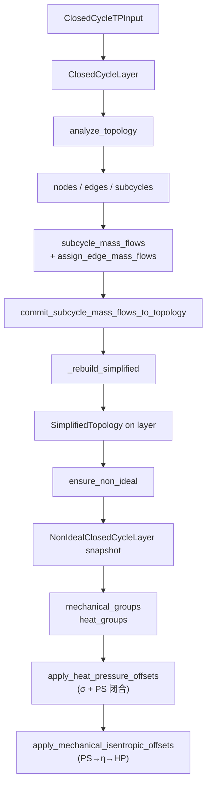

# CyGES 架构与算法细节

本文档是 CyGES 主干算法的**单一信息源**。代码 docstring、[`README.md`](../README.md)、[`AGENTS.md`](../AGENTS.md) 在涉及具体规则时统一引用本文件，避免多处描述漂移。

> 单位约定：`T[K]`、`P[kPa]`、`H[kJ/kg]`、`S[kJ/(kg·K)]`，字段名不缀单位。

---

## 1. 总体流程



**失效语义**：`analyze_topology()` 与 `commit_subcycle_mass_flows_to_topology()` 末尾都会重建 `simplified` 并清空 `non_ideal`。非理想分析须在理想层流量稳定后再 `ensure_non_ideal()`。

---

## 2. PS 平面约定

| 量 | 方向 |
|----|------|
| `P` | 自下而上增大 |
| `S` | 自左而右增大 |

每条边方向 `tail → head` 在容差意义下满足 `P_tail ≤ P_head` 且 `S_tail ≤ S_head`（即"向上且向右"）。
- **机械边**（叶轮机械工作）沿 P：`tail.edge_up` / `head.edge_down`。
- **换热边**（换热过程）沿 S：`tail.edge_right` / `head.edge_left`。

边定向由 [`oriented_edge`](../core/closed_cycle_layer.py) 在容差下判定，无法判定时抛 `RuntimeError`。

---

## 3. 拓扑构建流水线

[`build_node_edge_topology`](../core/closed_cycle_layer.py)：

1. `build_axis(t_min, t_max, t_quantiles)` 与 `build_axis(p_min, p_max, p_quantiles)` 生成温压一维采样。
2. **一级 TP 网格**：每个 `(T, P)` 调用 `state("TP", T, P)` 得 `H, S`；CoolProp 异常静默跳过并记入 `skipped_points`（仅诊断）。
3. **二级等熵延伸**：以每个一级点的 `S` 在 `p_axis` 上调用 `state("PS", P, S)`；落在 `[t_min, t_max]` 之外或异常的点丢弃。
4. **机械边 `M*`**：一级及其二级子点按 `P` 升序，相邻对生成 `mechanical`；方向由 `oriented_edge` 决定。
5. **换热边 `H*`**：所有节点按 `P` 分桶后按 `S` 升序，相邻节点生成 `heat`。
6. `_attach_edges_to_nodes_ps` 将边键回写到各 `Node.edge_{up,down,left,right}` 槽。

---

## 4. 子循环模板

[`build_subcycles`](../core/closed_cycle_layer.py) 枚举最小 4 节点环：

```
左上 ─上(H)─ 右上
 │              │
 左(M)        右(M)
 │              │
左下 ─下(H)─ 右下
```

走法：从 `n0`（左下）出发 `edge_up → 左上` → `edge_right → 右上` → `edge_down`（取该边 `tail` 为右下）→ `edge_left`（取 `tail`）须回到 `n0`，四节点互异。`frozenset({n0,n1,n2,n3})` 去重，每个物理单元至多输出一次。

约定：
- `SubCycle.nodes = (左下, 左上, 右上, 右下)` 顺时针。
- `SubCycle.edges = (左, 上, 右, 下)`；左/右为机械边，上/下为换热边。

---

## 5. 边流量汇聚

[`assign_edge_mass_flows_from_subcycles`](../core/closed_cycle_layer.py)：

- `SubCycle.mass_flow > 0` 表示工质沿顺时针 `(左下→左上→右上→右下→左下)` 流动；`< 0` 表示逆时针；`None` 按 `0` 计。
- 每条边的 `mass_flow` 是其穿过的所有子循环沿 `tail → head` 的代数和：
  - 顺时针段方向与 `Edge.tail→head` **同向** → `+q`。
  - **反向** → `-q`。
  - 顺时针段方向与 `(tail, head)` 不匹配 → 抛 `ValueError`（算法不变量被破坏）。
- 流程：先把所有边 `mass_flow` 置 `None`，再仅对至少出现一次的边写入累加结果（含 `0.0`）。

---

## 6. 精简拓扑

[`build_simplified_topology`](../core/closed_cycle_layer.py)：在活跃子图（"属于某子循环且边流量非零"）上做同类型链合并。

### 6.1 过滤
[`filter_topology_for_non_ideal`](../core/closed_cycle_layer.py)：

- 同时满足 (1) 至少出现在一个 `SubCycle.edges` 中 (2) `mass_flow` 非 `None` 且容差非零，才保留。
- 节点的邻边槽若指向被剔除边，置 `None`（避免后续链遍历误入死边）。

### 6.2 链合并切分

- 节点可合并性：
  - `edge_up = edge_down = None`（仅挂换热边） → 可并入换热链。
  - `edge_left = edge_right = None`（仅挂机械边） → 可并入机械链。
  - 否则（两类邻边都有，或四邻全空） → 作为切分点 / 链端 / 占位。
- `_find_typed_chains` 按 `kind` DFS 出每个连通分量为简单链；`_simplify_chain` 切分点之间合并为一条 `SimplifiedEdge`。

### 6.3 方向规范化

精简边 `tail → head` 按聚合 `mass_flow` 决定：

| 聚合 `mass_flow` | `tail` / `head` | 输出 `mass_flow` | `constituent_edges` / `merged_nodes` 顺序 |
|------------------|------------------|------------------|------------------------------------------|
| `None` / `0` | 沿 PS 正向 | 原值 | PS 正向 |
| `> 0` | 沿 PS 正向 | 原值 | PS 正向 |
| `< 0` | **反向** | `abs(原值)` | 反转 |

同一精简段内原始边 `mass_flow` 不一致（`math.isclose`）时抛 `ValueError`。

### 6.4 占位语义

过滤后四邻边槽**全空**且尚未上链的节点，追加 `(index, MERGED_ISOLATED_NODE_EDGE_KEY)` 至 `merged_into`。这些节点不出现在 `kept_nodes`，也没有对应的 `SimplifiedEdge`，可经 `merged_dict()` 查询。

`kept_nodes` = `nodes_f` 中**不**在 `merged_into` 任一条目键里的节点。

---

## 7. 有向组与深度

[`SimplifiedDirectedGroup`](../core/non_ideal_closed_cycle_layer.py) 是同 `kind`、**无向连通**的一组精简边。组内才有"深度"概念，组之间互不影响。

### 7.1 邻接
[`_group_adjacency`](../core/non_ideal_closed_cycle_layer.py) 用组内边的 `tail → head` 构建有向邻接表（用于深度），无向连通则交给并查集（[`partition_simplified_edges_by_kind`](../core/non_ideal_closed_cycle_layer.py)）。

### 7.2 `reach`：下游最长路径
[`compute_group_downstream_reach`](../core/non_ideal_closed_cycle_layer.py)：

- `reach(v)` = 从 `v` 沿 `tail → head` 能到达的最长路径边数；无出边 → `0`。
- 记忆化 DFS；遇有向环抛 `ValueError`。
- 用于 `upstream_special_nodes = argmax(reach)`（下游延伸最长者，`frozenset`，可并列）。

### 7.3 `layer`：上游最长路径（拓扑序 DP）
[`_compute_group_depth_metrics`](../core/non_ideal_closed_cycle_layer.py)：

- 源点（入度 0）`layer = 0`；每条 `u → v` 满足 `layer[v] = max(layer[v], layer[u] + 1)`。
- 实现：Kahn 拓扑序 + DP。
- 多源 DAG 下的层号反映"从任一源点沿组内边累计经过的过程步数"。
- 用于换热偏移 `σ^layer`。

**示例**：`A→B→C`, `A→D`, `E→D`
- `layer`：A=0, B=1, C=2, D=1, E=0。
- `reach`：A=2, B=1, C=0, D=0, E=1。
- `upstream_special_nodes = {A}`（`reach` 最大）。

### 7.4 同节点两套深度

同一 `Node.index` 可同时位于一个机械组与一个换热组中。两套深度在不同有向子图上计算，数值可以不同。**偏移/约束须按 `kind + 组` 查询 `group.depth_dict()`，不要用全局单表**。

### 7.5 已知问题：`layer` 与「主脊分层」语义不一致（待修正）

**当前实现**（`_compute_group_depth_metrics`）的 `layer(v)` = 从**任一入度 0 源点**到 `v` 的**有向最长路径**（Kahn + `layer[w]=max(layer[w], layer[u]+1)`）。因此**每个入度 0 的节点都会保持 `layer=0`**，且不会被入边抬高。

**期望语义**（换热 `σ^layer` 的物理含义）：在组内先选定一条**边数最多的有向路径**作为**主脊（参考路径）**，沿主脊赋 `0,1,…,L`；**支流与汇流**上的节点层号应对齐这条主脊刻度，而不是把每个源点都当作独立的 0 层。

| 拓扑（主脊一般为 `A→B→C`） | 当前实现 | 期望 |
|----------------------------|----------|------|
| `A→B→C`, `A→D`, `E→D` | A=0, E=0, B=1, D=1, C=2 | 与现实现一致（E 汇入 D=1，E=0） |
| `A→B→C`, `A→D`, `E→C` | A=0, **E=0**, B=1, D=1, C=2 | A=0, **E=1**, B=1, D=1, C=2 |

在 `E→C` 情形下，当前会把支流源点 `E` 当作第二个源点（`layer=0`），导致 `P_non_ideal(E)=P_ideal(E)`（少乘 σ），与「`E` 作为 `C` 的直接上游应和 `B` 同为 1 层」不一致。

**下一步**：重写组内 `layer` 计算（主脊选取 + 支流/汇流对齐），并补充 `E→C` / `E→D` 对照用例。`reach` / `upstream_special_nodes` 与机械锚点逻辑**暂不**随本项一并修改，除非后续确认需要同一套主脊定义。

---

## 8. 换热偏移：`σ` + 全表 `PS` 闭合

[`apply_heat_pressure_offsets`](../core/non_ideal_closed_cycle_layer.py)：

1. `σ` 取参数 → `self.heat_efficiency` → `config.NON_IDEAL_HEAT_EFFICIENCY_DEFAULT`，须在 `(0, 1]`。
2. 对每个 `heat_groups` 中的节点：

```
P_non_ideal(v) = P_ideal(v) × σ ** layer(v)
```

`layer` 由 `group.depth_dict()` 提供；始终以**理想** `P` 为底，避免重复偏移。

3. 末尾对 `self.nodes` 中**所有**节点调用 `state("PS", P_new, S)`，把 `T, H` 与新 `P` 自洽（`P,S` 以求解器返回值为准）。

不修改 `ideal_nodes` 与父层 `nodes`。建议先换热、后机械。

---

## 9. 机械偏移：`PS→η→HP`

[`apply_mechanical_isentropic_offsets`](../core/non_ideal_closed_cycle_layer.py)：

- `η_is` 取参数 → `self.mechanical_efficiency` → `config.NON_IDEAL_MECHANICAL_EFFICIENCY_DEFAULT`，须在 `(0, 1]`。
- **须先**调用 `apply_heat_pressure_offsets()` 让 `P, H` 反映换热后的状态。
- 对每个机械组：选锚点 → 从锚点 DFS 沿无向支路单向推进 → 每条精简边由已知端推未知端。

### 9.1 机械锚点决策

[`_pick_mechanical_anchor`](../core/non_ideal_closed_cycle_layer.py)，决策树：

1. 一级节点（`parent is None`）且 ∈ `upstream_special_nodes` → 该一级（并列时 `index` 最小）。一级本来就是熵不动点，且位于 `reach` 最大处。
2. 否则若 `upstream_special_nodes` 非空 → `min(upstream_special_nodes)`。分叉组中一级在侧枝时退化。
3. 否则任一一级节点（`index` 最小）。
4. 否则 `min(v | layer(v) == 0)`。
5. 仍找不到 → `ValueError`（理论不可达）。

锚点**整点状态不变**。

### 9.2 机械步公式

[`_mechanical_step_known_to_unknown`](../core/non_ideal_closed_cycle_layer.py) 沿一条精简机械边由已知端 `k` 推未知端 `u`：

1. **等熵焓**：在待求端 `P_u` 下沿用已知端熵 `S_k`：
   ```
   H1 = state("PS", P_u, S_k)["H"]
   ```
2. **真实焓**：按边方向（`P_head` vs `P_tail`，与精简边几何一致）：
   - 压缩（`P_head > P_tail`）：`H2 = (H1 - H_k) / η_is + H_k`
   - 膨胀（`P_head < P_tail`）：`H2 = (H1 - H_k) × η_is + H_k`
   - 等压（容差内相等）：`H2 = H_k`（等熵假设下 `H1 ≡ H_k`）
3. **闭合**：`state("HP", H2, P_u)` 写回 `T, P, H, S`。非理想状态下 `S` 一般 `≠ S_k`。

### 9.3 支路传播

[`_walk_mechanical_branches`](../core/non_ideal_closed_cycle_layer.py)：

- 对每个机械组建无向邻接表 `(邻居, 边键)`。
- 从锚点出发，对每个邻居各开一条 DFS 支路；栈中 `(prev, cur)` 表示"已知 prev → 待更新 cur"，仅沿远离锚点方向推进。
- 每条精简边只被使用一次。
- 与锚点无向不连通的节点不会被更新，调用方发 `RuntimeWarning`。

---

## 10. 待办与约束（备忘）

- 非理想方程/约束装配、多目标优化器：未实现。
- 换热网络（HEN）与多热源/多冷源边界耦合：未实现。
- 当前算法不强约束沿机械边 `ΔS ≥ 0`；大多数物理情况下成立。如需硬约束，可加偏移后校验或切换闭合策略。
- 每条精简边的效率目前共用 `config` 默认值；按边/按组分别赋值尚未做。
